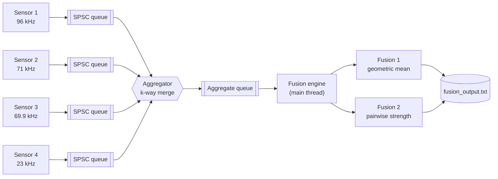
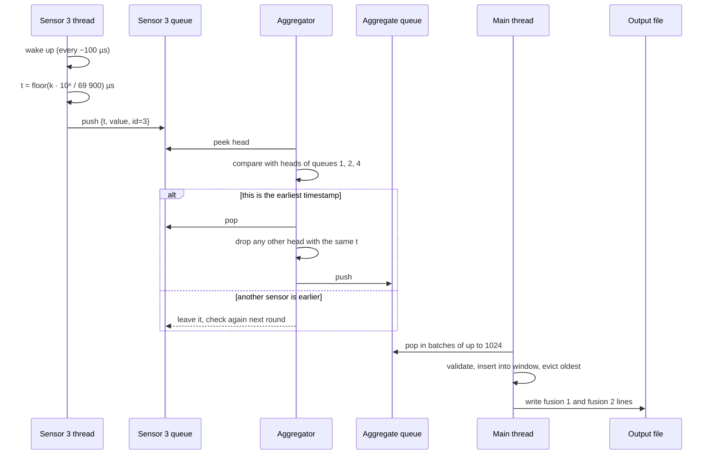
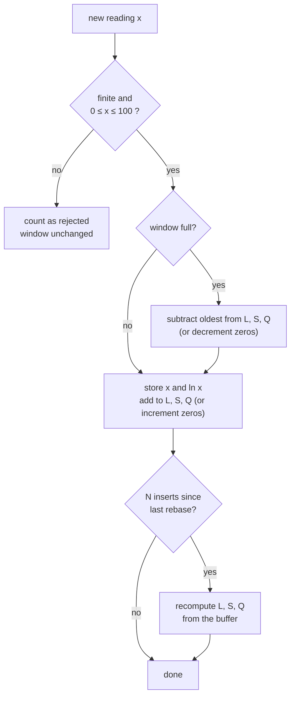

# Architecture

This note explains how the pipeline is put together and why it ended up this
way. The README covers building and running it; this is the "how does it
actually work" document.

## The big picture

There are six threads and five queues. Data only ever moves left to right.



If your viewer doesn't render Mermaid, here is the same thing in plain text:

```
 sensor thread 1 ──► [queue] ──┐
 sensor thread 2 ──► [queue] ──┤
 sensor thread 3 ──► [queue] ──┼──► aggregator thread ──► [queue] ──► main thread ──► output file
 sensor thread 4 ──► [queue] ──┘                                      (fusion + writer)
```

Every arrow has exactly one writer and one reader. That one fact drives most
of the design. Since no queue is ever shared by two producers or two
consumers, none of them needs a lock.

## Module map

| Module                  | Owns                                                        | Depends on               |
|-------------------------|-------------------------------------------------------------|--------------------------|
| `sample.h`              | the 24-byte record that flows through the system            | –                        |
| `spsc_queue.{h,c}`      | bounded lock-free ring buffer                               | `sample.h`               |
| `sensor.{h,c}`          | timestamp maths, signal generation, pacing                  | queue, clock, rng        |
| `aggregator.{h,c}`      | merging streams in time order, resolving collisions         | queue, backoff           |
| `fusion.{h,c}`          | the sliding window and both fusion functions                | libm only                |
| `writer.{h,c}`          | timestamped, buffered output                                | libc only                |
| `backoff`, `clock`, `rng` | small utilities                                           | POSIX                    |
| `main.c`                | argument parsing, wiring, lifetime                          | everything above         |

The fusion engine doesn't know threads, queues or sensors exist. It takes
doubles and answers two questions. That's why the same code runs unchanged
inside the live pipeline, in the `fusion_file` tool and in the unit tests.

## Life of a sample

Here's what happens to a single reading from sensor 3.



## Time

The sensors share a synchronized clock, so all four start from the same
origin. Sample `k` of a sensor running at `f` Hz is stamped:

```
t(k) = floor(k × 1 000 000 / f)   microseconds
```

The frequency is stored as an integer in millihertz, which keeps the whole
calculation in integers. I went this way because the spec asks whether two
timestamps are "identical to the microsecond". With floating-point periods
that question gets a slightly different answer depending on how the rounding
falls. With integers the answer is exact, and it's the same on every run and
every machine.

A handy side effect: the number of samples a sensor produces in `D`
microseconds is known in advance (`ceil(D × f / 10⁶)`). The tests use this to
check that nothing was lost.

### Pacing

A 96 kHz sensor produces a sample every 10.4 µs. You can't sleep for 10 µs
reliably on Linux, and spinning a core per sensor would waste four cores. So
each sensor thread wakes roughly every 100 µs, looks at the clock, emits
every sample whose timestamp has passed, and sleeps again. Because the
timestamps come from `k`, not from when the thread happened to wake up,
batching changes nothing about the data.

## The queues

```
             producer-owned cache line            consumer-owned cache line
          ┌──────────────────────────────┐     ┌──────────────────────────────┐
          │ tail          cached_head    │     │ head          cached_tail    │
          └──────────────────────────────┘     └──────────────────────────────┘
                                   ┌────┬────┬────┬────┬────┬────┬────┬────┐
                          slots:   │    │ s3 │ s4 │ s5 │ s6 │    │    │    │   capacity = 2ⁿ
                                   └────┴────┴────┴────┴────┴────┴────┴────┘
                                          ▲ head              ▲ tail
```

A few details that matter:

- Head and tail live on separate cache lines, so the producer and consumer
  don't fight over the same line.
- Each side keeps a private copy of the other side's index and only rereads
  the shared one when its copy says the queue looks full (or empty). Most
  pushes and pops touch no shared memory except the slot itself.
- The only synchronisation is one release store and one acquire load per
  operation.
- Queues are bounded. When one is full the producer waits. Nothing is ever
  dropped, because the spec says sensors never miss a value.
- A `closed` flag, set after the last push, lets the reader tell "empty right
  now" apart from "finished for good".

## The aggregator

The aggregator is a k-way merge with one extra rule. Each round it:

1. Looks at the head of every queue, in order of **ascending frequency**
   (23 kHz first, 96 kHz last).
2. If a queue is empty but its sensor is still running, it waits. It can't
   know yet whether that sensor's next sample will be the earliest one.
3. Picks the smallest timestamp, using a strict `<`. Because of the scan
   order, a tie always goes to the lower-frequency sensor, which is exactly
   what the spec asks for.
4. Pops the winner, pops and counts any other head with the same timestamp,
   and forwards the winner.
5. Stops once every queue is closed and empty, then closes its own output.

Step 2 is the important one. It's what guarantees the output is globally
sorted and not just "mostly sorted".

These are the real timestamps for the first 60 µs (✓ kept, ✗ dropped):

```
time (µs) →  0    10   14   20   28   31   41   42   43   52   56   57
96 kHz       ✗    ✓         ✓         ✓    ✓              ✓
71 kHz       ✗         ✗         ✗              ✗              ✓
69.9 kHz     ✗         ✓         ✓              ✓                   ✓
23 kHz       ✓                                       ✓
```

All four collide at t = 0, and the 23 kHz sample is kept. The 71 kHz and
69.9 kHz sensors are so close in frequency that they keep landing on the same
microsecond (14, 28, 42, ...), and each time the 69.9 kHz value wins. In a 5 s
run that works out to roughly 75 k dropped samples from sensor 1, 39 k from
sensor 2 and 8.5 k from sensor 3. Sensor 4 never loses a collision.

## The fusion engine

### Data layout

```
 ring buffer of N slots (16 bytes each)
 ┌───────────┬───────────┬───────────┬─────┬───────────┐
 │ x, ln x   │ x, ln x   │ x, ln x   │ ... │ x, ln x   │
 └───────────┴───────────┴───────────┴─────┴───────────┘
                    ▲ next write = oldest value once the window is full

 running state:  L = Σ ln x   (positive values only)
                 S = Σ x
                 Q = Σ x²
                 zeros = how many exact zeros are in the window
```

`ln x` is stored next to `x` so that evicting a value doesn't mean computing
its logarithm a second time.

### Insert / evict



### The two functions

```
fusion 1 = 0                          if zeros > 0
         = exp(L / N)                 otherwise

fusion 2 = sqrt( (S² − Q) / N )              formula as printed  (default)
         = sqrt( (S² − Q) / (N·(N−1)) )      mean of pairwise products
```

The trick in fusion 2 is that `Σ over i≠j of xᵢxⱼ` equals `S² − Q`. That
turns an O(N²) double loop into two numbers kept up to date as samples come
and go.

### Keeping the numbers honest

Adding and subtracting millions of doubles from a running total slowly
accumulates rounding error. Two things keep it in check:

- **Compensated (Neumaier) summation.** Each running sum carries a small
  correction term that catches most of what normal addition throws away.
- **Periodic rebase.** Every N inserts the sums are recomputed exactly from
  the buffer. That's O(N) work once every N samples, so it averages out to
  O(1) per sample, and it puts a hard ceiling on how far the error can grow.

One of the tests pushes three million values whose size jumps between 0.001
and 100 and then compares against a `long double` recomputation. They agree
to about 11 significant digits.

## Waiting strategy

Every stage that has to wait (a full queue, an empty queue) uses the same
three-step backoff:

```
 spin with a CPU pause hint  ──(64 tries)──►  sched_yield()  ──(64 tries)──►  sleep 50 µs
                    ▲                                                            │
                    └──────────── reset as soon as work shows up ────────────────┘
```

A busy stage reacts in nanoseconds, and an idle stage drops to almost no CPU.

## Shutdown

Shutdown is a chain of `closed` flags, not a signal or a global "stop" boolean:

```
sensor finishes its last sample ─► closes its queue
all four sensor queues closed and drained ─► aggregator closes the aggregate queue
aggregate queue closed and drained ─► main thread stops consuming
main joins all threads ─► writes sensor counts ─► "Program finished"
```

Because every stage drains its input before closing its output, nothing is
left in flight when the program exits. That's how the "keep printing until
the aggregate queue is empty" requirement is met.

## Things I'd change for production

- Pin threads to cores and give sensors real-time priority for tighter pacing.
- Write the output in binary, or at least from a separate thread, if the
  full per-sample trace is really needed at these rates.
- Make the collision policy configurable. Today an invalid reading from the
  lower-frequency sensor still wins a collision, as the rule is written.
- Support a runtime-configurable number of sensors, not a compile-time table.
